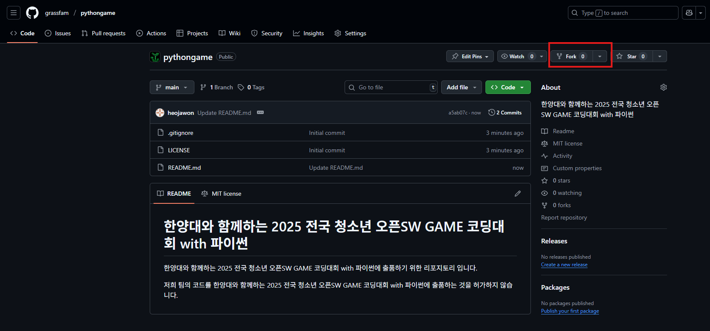
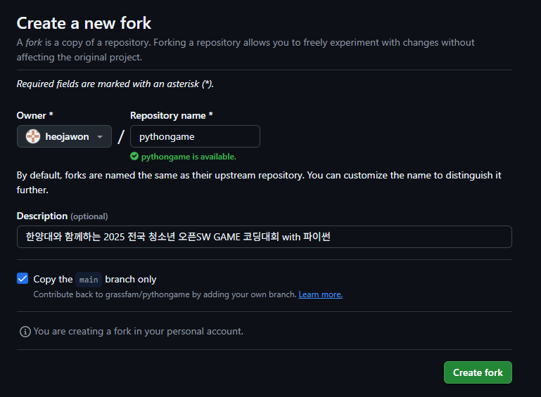
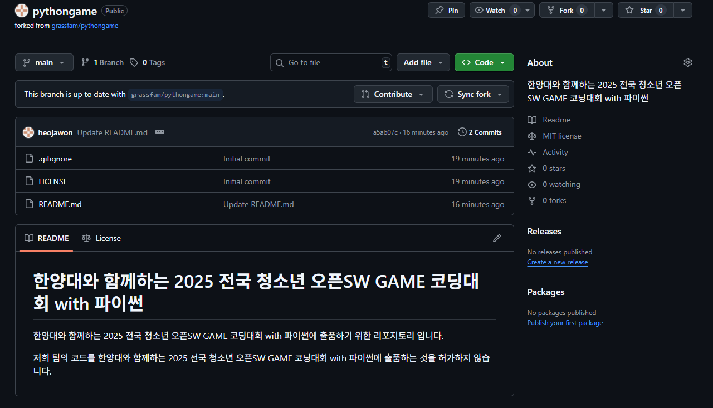

# 한양대와 함께하는 2025 전국 청소년 오픈SW GAME 코딩대회 with 파이썬

한양대와 함께하는 2025 전국 청소년 오픈SW GAME 코딩대회 with 파이썬에 출품하기 위한 리포지토리 입니다.

저희 팀의 코드를 한양대와 함께하는 2025 전국 청소년 오픈SW GAME 코딩대회 with 파이썬에 출품하는 것을 허가하지 않습니다.

## 깃허브 리포지토리 로컬 연결 방법

fork를 사용해 자신의 계정에 리포지토리를 생성한 후, 해당 리포지토리에서 작업을 진행하여 메인 리포지토리에 pr을 요청합니다.

위와 같이 fork 버튼을 클릭하여 fork를 진행합니다.

따로 변경할 수정 사항은 없고, 바로 `Create fork`를 눌러 진행합니다.

이제 fork된 리포지토리가 생성되었습니다. 해당 리포지토리를 `git clone`을 통해 로컬에 가져와 작업합니다.

> 자세한 내용은 관리자에게 문의하세요.
